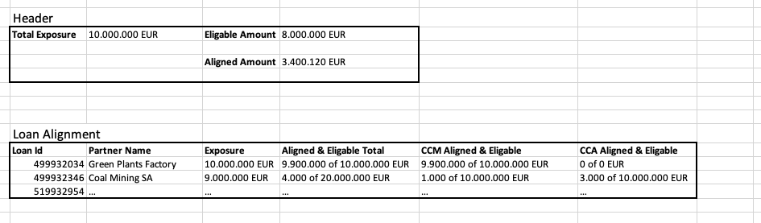

# Our Mission: Sustainable Finance Platform
We're building a "Sustainable Finance Platform" for "Banking Customers" that makes "Working with ESG data easy" - but what the heck does that mean?!

That's difficult to explain in one sentence, so let's just leave it with an oversimplified and bold example:
 - ESG = Environmental (main focus!), Social, Government
 - A bank "Big Bank AG" needs to report according to EU Taxonomy law how "green" (=eco friendly) it is
 - Therefore it e.g. needs to understand & quantify how "green" the loans are that it gave to business partners
 - Therefore it needs to understand for a single loan (EUR 100.000.000) it gave to a business partner "Big Energy Company AG" what activities are financed with that loan and how "green" are they (e.g. financed an eco-friendly windenergy park? financed a coal mine?)

This means: We are building a product that makes such environmental-related tasks very easy for banks. 

# Frontend Challenge
You can code - we trust you on that one - However we'd like to understand your style in a realistic environment:
 - Our techstack (languages, libraries)
 - Real problems you would be facing (yeah, we don't need the 1000th sorting algorithm)
 - Realistic situation (normally on the job you don't do live-codings with 5 people looking over your shoulder)

For that we ask you to write a small frontend that consumes and shows data we will be using on the project.

## Technical Constraints
 - Language: Typescript (if not possible: JS also ok)
 - Framework: Angular, Vue, React (You choose!)
 - Design System: SAP UI5 https://sap.github.io/ui5-webcomponents/
   - Will be used in the product, so it's a good idea to dip your toes 😉
   - Angular Sample: https://github.com/SAP-samples/ui5-webcomponents-sample-angular
   - Vue Sample: https://github.com/SAP-samples/ui5-webcomponents-sample-vue
   - React Sample: https://github.com/SAP-samples/ui5-webcomponents-sample-react

## Requirements - What will you build

> Please note that some parts of the coding challenge are ✅ mandatory and others are ☑️ optional️

 - **Page Layout** ✅ mandatory
   - Build a single page with 2 sections:
     - Header (OPTIONAL FOR CODE CHALLENGE: JUST A BONUS)
     - Loan Alignment

 - **Header Section** ☑️ optional️
   - UI5 Suggestion: Panel
   - Title "Alignment Overview"
   - Total exposure (monetary amount)
   - Eligable amount (monetary amount)
   - Aligned amount (monetary amount)
   - More details in [README-header-details.md](./README-header-details.md)

 - **Loan Alignment Table** ✅ mandatory, parts of it ☑️ optional️
   - UI5 Suggestion: Table
   - A Table
   - Every row
     - Shows one loan the bank gave to a business partner
     - Some columns ESG-data calculated from a JSON
     - More details in [README-loan-details.md](./README-loan-details.md)

     
 - **Datasource** ✅ mandatory
   - When the page loads, please retrieve the underlying json data via REST first
   - For that please run the following commands and check http://localhost:8080/taxonomy/loans/loans.json
     > npm install
     > 
     > npm run dev
   - The json structure can also be seen here: [loans.json](./public/taxonomy/loans/loans.json)
   - The json structure might seem overwhelming, but actually you are only interested in 3 parts:
     - "Metadata" contains everything you need for the header section
     - "Product" contains the total exposure amount of a loan
     - "Datapoints" all values are stored at the lowest level and just need to be summed up correctly
   - More details in [README-loan-details.md](./README-loan-details.md)

 - **Unit Test** ✅ mandatory
   - Please write a unit test for the Loan Alignment Table (Framework: Jest, Mocha, .. You choose!)
   - Check overall: Number of rows is correct (see loan table mapping description)
   - Check for every row: The column "CCM Aligned & Eligable" shows the correct values
